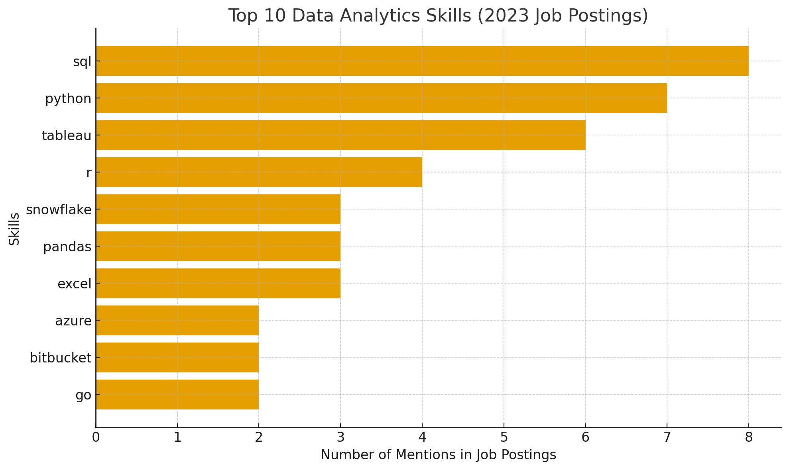
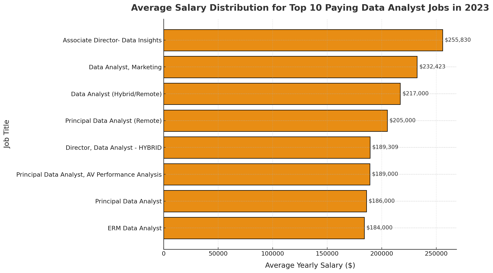

# SQL_Analyze_Job

# Introduction
📊 Step into the world of data analytics hiring! This project takes you on a journey through the 2023 job market for **Data Analyst** roles — uncovering 💰 the highest-paying positions, 🔥 the most in-demand skills, and 📈 the sweet spot where **salary meets opportunity**.

🔍 Curious about how it was done? Explore all my SQL queries here: [project_sql folder](/project_sql/)

---

# Background
The idea for this project was born from a simple question — *what does it really take to land one of the top-paid data analyst jobs today?*

I wanted to go beyond job titles and buzzwords to see which **skills**, **tools**, and **roles** truly stand out in the market. The goal: help myself and others navigate the data job landscape more strategically.

The dataset comes from [Luke Barousse’s SQL Course](https://lukebarousse.com/sql) — a rich collection of job postings packed with details about salaries, companies, locations, and required skills.

### The questions I set out to answer:
1. What are the top-paying data analyst jobs?  
2. What skills do these top-paying jobs require?  
3. Which skills are most in demand overall?  
4. Which skills lead to higher salaries?  
5. And ultimately — what are the most *valuable* skills to learn?

---

# Tools I Used
To dive deep into this analysis, I leaned on a toolkit built for real data exploration:

- **SQL** – The heart of the project, used to slice, join, and analyze job posting data.  
- **PostgreSQL** – A robust database engine to manage complex queries efficiently.  
- **Visual Studio Code** – My command center for running SQL and managing data files.  
- **Git & GitHub** – For version control, collaboration, and publishing my SQL scripts and visualizations.

---

# The Analysis
Each SQL query was designed to uncover a piece of the story behind data analyst careers — from salaries and demand to skill optimization.

---

### 1. Top-Paying Data Analyst Jobs
To spotlight the most lucrative positions, I filtered for **Data Analyst** roles that were remote and had reported salaries.

```sql
SELECT	
	job_id,
	job_title,
	job_location,
	job_schedule_type,
	salary_year_avg,
	job_posted_date,
    name AS company_name
FROM
    job_postings_fact
LEFT JOIN company_dim ON job_postings_fact.company_id = company_dim.company_id
WHERE
    job_title_short = 'Data Analyst' AND 
    job_location = 'Anywhere' AND 
    salary_year_avg IS NOT NULL
ORDER BY
    salary_year_avg DESC
LIMIT 10;


*Bar graph visualizing the salary for the top 10 salaries for data analysts

Key takeaways:
** Salaries ranged widely, from $184K up to $650K, proving that data analytics offers room for serious growth.
** Top employers like SmartAsset, Meta, and AT&T show that high-paying opportunities span multiple industries.
** Titles varied — from Data Analyst to Director of Analytics — revealing how diverse the analytics career ladder can be.


### 2. Skills for Top Paying Jobs

To find what sets these top jobs apart, I connected the high-salary roles with their listed skills.

```sql
WITH top_paying_jobs AS (
    SELECT	
        job_id,
        job_title,
        salary_year_avg,
        name AS company_name
    FROM
        job_postings_fact
    LEFT JOIN company_dim ON job_postings_fact.company_id = company_dim.company_id
    WHERE
        job_title_short = 'Data Analyst' AND 
        job_location = 'Anywhere' AND 
        salary_year_avg IS NOT NULL
    ORDER BY
        salary_year_avg DESC
    LIMIT 10
)

SELECT 
    top_paying_jobs.*,
    skills
FROM top_paying_jobs
INNER JOIN skills_job_dim ON top_paying_jobs.job_id = skills_job_dim.job_id
INNER JOIN skills_dim ON skills_job_dim.skill_id = skills_dim.skill_id
ORDER BY
    salary_year_avg DESC;
```

Insights:
**SQL** was the most requested skill, appearing in 8 of the top 10 postings.
**Python** followed closely (7 mentions), with Tableau not far behind (6 mentions).
Other valuable tools — **R, Snowflake, Pandas, and Excel** — also made the list, rounding out the data toolkit that employers prize.


### 3. In-Demand Skills for Data Analysts

This query focused on which skills show up most frequently across all remote job postings — not just the top-paying ones.

```sql
SELECT 
    skills,
    COUNT(skills_job_dim.job_id) AS demand_count
FROM job_postings_fact
INNER JOIN skills_job_dim ON job_postings_fact.job_id = skills_job_dim.job_id
INNER JOIN skills_dim ON skills_job_dim.skill_id = skills_dim.skill_id
WHERE
    job_title_short = 'Data Analyst' 
    AND job_work_from_home = True 
GROUP BY
    skills
ORDER BY
    demand_count DESC
LIMIT 5;


```


*Bar graph visualizing the count of skills for the top 10 paying jobs for data analysts;

What the data revealed:
**SQL** and **Excel** dominate — still the bedrock skills for analysis and reporting.
**Python, Tableau, and Power BI** are essential for technical storytelling and advanced analytics.

| Skills   | Demand Count |
|----------|--------------|
| SQL      | 7291         |
| Excel    | 4611         |
| Python   | 4330         |
| Tableau  | 3745         |
| Power BI | 2609         |

*Table of the demand for the top 5 skills in data analyst job postings*

### 4.Skills Associated with Higher Salaries

Here I looked at which skills correlate with higher average salaries among data analyst roles.

```sql
SELECT 
    skills,
    ROUND(AVG(salary_year_avg), 0) AS avg_salary
FROM job_postings_fact
INNER JOIN skills_job_dim ON job_postings_fact.job_id = skills_job_dim.job_id
INNER JOIN skills_dim ON skills_job_dim.skill_id = skills_dim.skill_id
WHERE
    job_title_short = 'Data Analyst'
    AND salary_year_avg IS NOT NULL
    AND job_work_from_home = True 
GROUP BY
    skills
ORDER BY
    avg_salary DESC
LIMIT 25;
```

Insights from the data:
- **Big Data & ML tools like PySpark, DataRobot, and Jupyter command the highest pay.
- **Development & pipeline tools such as GitLab, Airflow, and Kubernetes bridge analytics and engineering — a lucrative combo.
- **Cloud technologies like Databricks and GCP push salaries higher, reflecting a growing shift toward cloud analytics.

| Skills        | Average Salary ($) |
|---------------|-------------------:|
| pyspark       |            208,172 |
| bitbucket     |            189,155 |
| couchbase     |            160,515 |
| watson        |            160,515 |
| datarobot     |            155,486 |
| gitlab        |            154,500 |
| swift         |            153,750 |
| jupyter       |            152,777 |
| pandas        |            151,821 |
| elasticsearch |            145,000 |

### 5. The Most Optimal Skills to Learn
Finally, I combined both salary and demand data to find the sweet spot — skills that are both valuable and sought after
```sql
SELECT 
    skills_dim.skill_id,
    skills_dim.skills,
    COUNT(skills_job_dim.job_id) AS demand_count,
    ROUND(AVG(job_postings_fact.salary_year_avg), 0) AS avg_salary
FROM job_postings_fact
INNER JOIN skills_job_dim ON job_postings_fact.job_id = skills_job_dim.job_id
INNER JOIN skills_dim ON skills_job_dim.skill_id = skills_dim.skill_id
WHERE
    job_title_short = 'Data Analyst'
    AND salary_year_avg IS NOT NULL
    AND job_work_from_home = True 
GROUP BY
    skills_dim.skill_id
HAVING
    COUNT(skills_job_dim.job_id) > 10
ORDER BY
    avg_salary DESC,
    demand_count DESC
LIMIT 25;
```

| Skill ID | Skills     | Demand Count | Average Salary ($) |
|----------|------------|--------------|-------------------:|
| 8        | go         | 27           |            115,320 |
| 234      | confluence | 11           |            114,210 |
| 97       | hadoop     | 22           |            113,193 |
| 80       | snowflake  | 37           |            112,948 |
| 74       | azure      | 34           |            111,225 |
| 77       | bigquery   | 13           |            109,654 |
| 76       | aws        | 32           |            108,317 |
| 4        | java       | 17           |            106,906 |
| 194      | ssis       | 12           |            106,683 |
| 233      | jira       | 20           |            104,918 |

Highlights:
- ** Programming languages like Python and R remain top choices for their versatility and demand.
- ** Cloud technologies (Snowflake, Azure, AWS, BigQuery) are rapidly becoming must-have skills for high-level analytics work.
- ** Visualization tools (Tableau, Looker) continue to dominate in translating data into insight.
Database management skills — both SQL and NoSQL — ensure a strong foundation for every analyst.

# What I Learned

Throughout this project, I leveled up not just my SQL abilities — but my ability to think like a data analyst:
- **🧩 Complex Queries: Mastered advanced joins and subqueries with WITH clauses to structure cleaner analyses.
- ** 📊 Aggregation Mastery: Leveraged GROUP BY, COUNT(), and AVG() to summarize job trends effectively.
_ ** 💡 Analytical Mindset: Transformed questions into insights, and insights into clear, data-driven stories.

# Conclusions

### Insights

1. **Top-Paying Data Analyst Jobs**: Remote data analyst jobs can reach salaries as high as $650K — showing the upper potential of analytics careers.
2. **SCritical Skills**: SQL remains the universal language of analytics, essential for both high pay and high demand.
3. **Emerging Trends**:Cloud, engineering, and ML tools are reshaping what it means to be a “data analyst.”
5. **Optimization**: The most valuable skills balance both market demand and salary growth potential.

###Final Thoughts
This project strengthened my technical foundation and deepened my understanding of today’s data job market. 
